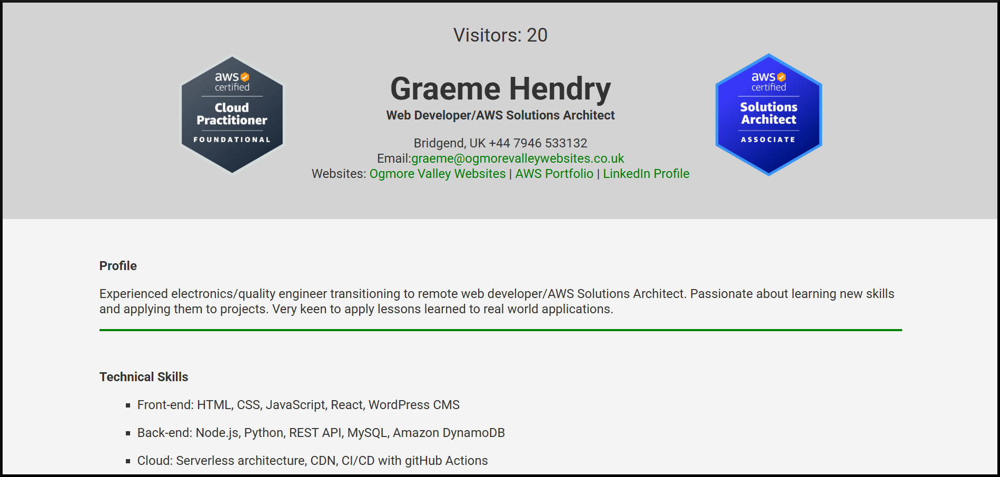
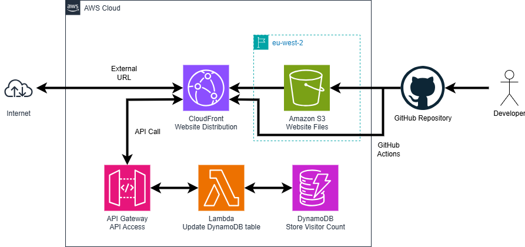

# Cloud Resume Challenge Front-End

## Summary

The Cloud Resume Challenge is a guided project to generate a resume webpage hosted in the cloud using cloud resources and development best practices. It comes in 3 flavours - AWS, Azure, and Google. Part 1 is to build a static webpage and then add a back-end to store a count of visitors that can be displayed on the page.

## Architecture

| **Service**        | **Description**                                                                                                                                                                                                                  | **Cost**                                                                                                                      |
| ------------------ | -------------------------------------------------------------------------------------------------------------------------------------------------------------------------------------------------------------------------------- | ----------------------------------------------------------------------------------------------------------------------------- |
| Amazon S3          | S3 is a highly available object storage service.hosting                                                                                                                                                                          | $0.01/month                                                                                                                   |
| Amazon CloudFront  | Amazon CloudFront speeds up distribution of static and dynamic web content. When users request your content, CloudFront delivers it through a worldwide network of edge locations that provide low latency and high performance. | Free                                                                                                                          |
| Amazon API Gateway | Amazon API Gateway enables you to create and deploy your own REST and WebSocket APIs at any scale.                                                                                                                               | $1.16 per 1 million API calls/month                                                                                           |
| AWS Lambda         | With AWS Lambda, you can run code without provisioning or managing servers.                                                                                                                                                      | $0.0000166667 for every GB-second/month. $0.20 per 1M requests                                                                |
| Amazon DynamoDB    | Amazon DynamoDB is a fully managed NoSQL database service that provides fast and predictable performance with seamless scalability.                                                                                              | $0.7423 per million write request units/month. $0.1487 per million read request units/month. First 25 GB stored/month is free |
| GitHub Actions     | Continuous Integration/Continuous Deployment (CI/CD) to deploy the static website                                                                                                                                                | Free                                                                                                                          |

## Description

An external domain name with TLS/SSL certification is used to access a Amazon CloudFront distribution, whose origin is an S3 bucket containing the static webpage files. The webpage files are automatically deployed from a GitHub repository using GitHub Actions

To update the visitor counter, whenever the webpage is loaded, javascript within the webpage makes a POST API call to the endpoint of the Amazon API Gateway HTTP API. The API call triggers the AWS Lambda function to increment the visitor counter and update the Amazon DynamoDB NoSQL database table. The API call returns the new value of the counter so that the contents of the counter element can be updated.

The initial stages of the challenge include:

1. **Set up accounts for development and production workloads using AWS Organizations and Organizational Units (OU).** Accounts take advantage of the Free Tier from AWS during development.
2. **Secure login to the accounts using AWS SSO.** SSO login applies temporary credentials to the user.
3. **Build the static website using HTML and CSS.** Store the website files in an S3 bucket. Set up a GitHub repository to manage version control.
4. **Secure the site using Amazon CloudFront.** Set up a CloudFront distribution using the S3 bucket as its origin.
5. **Point a custom domain name to the CloudFront distribution.** Use an external domain name with an SSL certificate to route to the CloudFront distribution.
6. **Implement the front-end of the visitor counter using JavaScript.** Select the counter element and update it by making a POST request to the back-end whenever the DOM is loaded
7. **Set up an Amazon DynamoDB table to hold the value of the visitor counter.** The table uses a single number field to store the latest value of the visitor counter
8. **Create an HTTP API using Amazon API Gateway to allow the front-end to access the back-end.** Enable Cross-Origin Resource Sharing (CORS) to allow the front-end to make API requests to API Gateway.
9. **Trigger an AWS Lambda function from API Gateway whenever a POST request is received from the front-end.**
10. **Write the Lambda code using Python and boto3 SDK to take the current value of the counter and upload an incremented value to the database.** Manage IAM permissions to allow the Lambda function to access the DynamoDB table.
11. **Create a Cypress E2E test specification to check that the backend is working** Install Cypress and write a Cypress specification to open the site and check that the visitor count increments.
12. **Deploy the front-end using GitHub Actions whenever the front-end code is updated.** When the GitHub repository is synced, GitHub Actions runs the Cypress test and, if OK, uploads the new website files to the S3 bucket, invalidating the CloudFront distribution to update its cache.

## Conclusion

This project shows my CV as a static webpage in the cloud with access to a serverless back-end to store and update a count of visitors to the page. It familiarised me with the practical issues of front-end and back-end serverless technologies to create a dynamic website.
